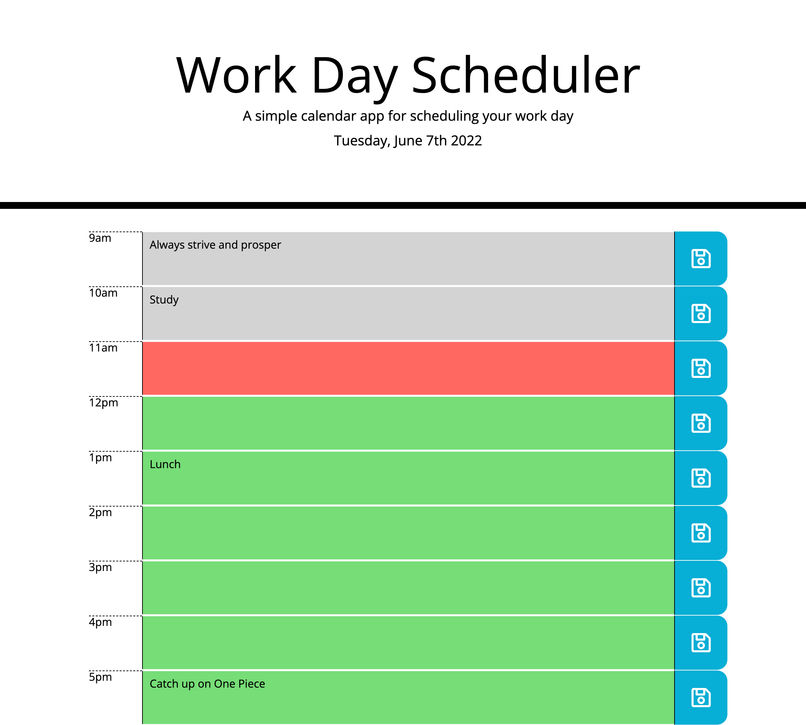

# Work Day Scheduler

## Table of Contents

* [Description](#description)
* [Technologies](#technologies)
* [Setup](#setup)
* [Webpage Demo](#webpage-demo)

---

## Description

The purpose of this project is create a work day scheduler to demonstrate my skills using libraries such as jQuery and Boostrap as well as third party APIs such as Moment.js.

---

## Technologies

* HTML5
* CSS
* Javascript
* jQuery
* Bootstrap
* Moment.js

---

## Setup

* To run this project clone the repository and open in your prefered code editor. Open index.html in your browser.
* Click the middle column text area to enter text and click the button on the right to save that time block.
* Delete text from text area remove the text and hit the save button for that time block.

---

## Webpage Demo

Link to webpage: [**Work Day Scheduler**](https://jarydknight.github.io/work-day-scheduler/)

